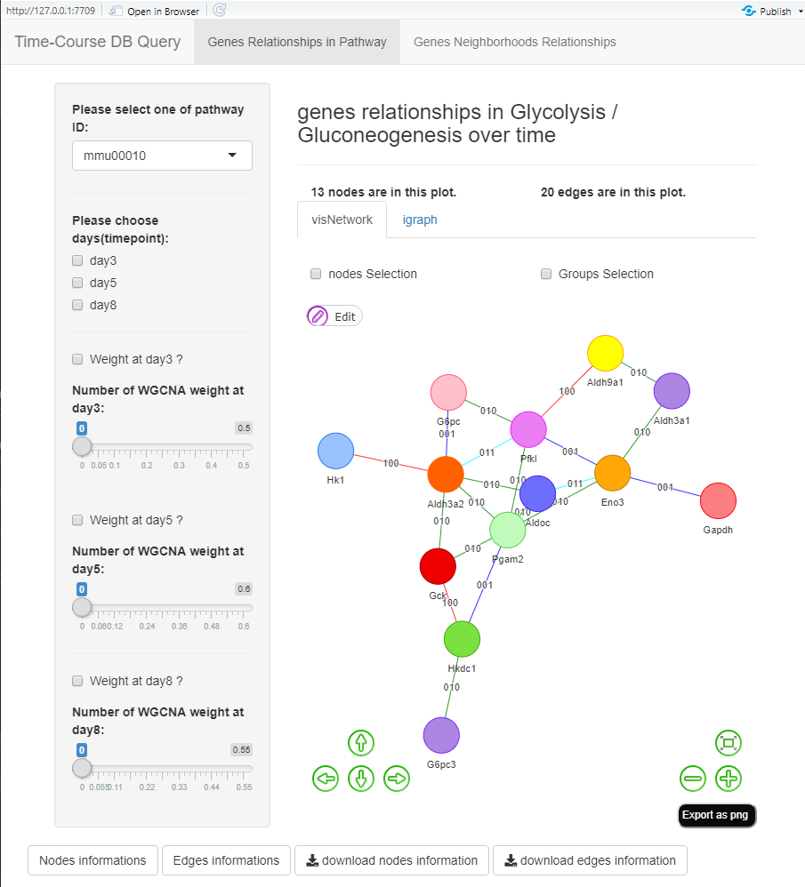

# time_courseDB_v3

# Function of neo4j time course shiny
This repository is for using in neo4j time course database version 3.
During this shiny, you can select one pathway to see genes relationships via WGCNA over time and special gene neighborhood relationships via WGCNA.

# How to run

## condition 1
directely run the codes if you are in our lab:
```
library(shiny)
runGitHub("xiaowei3223/neo4j_time_course_shiny")
```
## condition 2
If you are not in our lab, you need:   
**step1**      
Before you run this shiny, you need to start neo4j database and using my database, so you need to download this [database](https://github.com/xiaowei3223/database/raw/master/time_courseDB_v3.7z).  
Also, you should make http://10.168.119.229:7474 changed to your local neo4j browser intrerface website(http://localhost:7474/) and `xiaowei` as password and `neo4j` as username. Or not, you need to change
my codes at connected neo4j.

**step2**  
Run this codes:
```
library(shiny)
runGitHub("xiaowei3223/neo4j_time_course_shiny")
```

# This shiny interface shows like as following:


